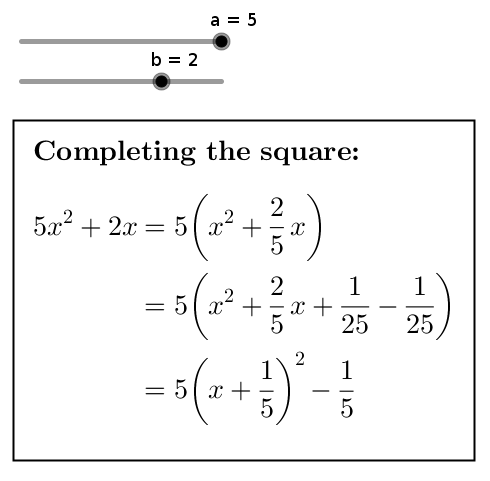

<!-- README.md is generated from README.Rmd. Please edit that file -->

[](https://lifecycle.r-lib.org/articles/stages.html#experimental)
<!-- badges: end -->

# ggtex-gawk

# Description

You can define text objects in Geogebra containing complex math in LaTeX
math mode, but the editor Geogebra offers for this is not very
convenient.

For example, you must use your mouse to open a drop-down list and select
an item everytime you want to insert the value of a Geogebra object
(i.e., a number, a formula etc.) in the text.

`ggtex.awk` is a tiny script written in [the `gawk`
language](https://www.gnu.org/software/gawk/) to translate from modified
LaTeX math mode to Geogebra code to define text objects.

With `ggtex.awk`, while using your favorite LaTeX text editor, you can
reference Geogebra objects surrounding them with the symbol `@`.

If you want to preview the contents of your text, you can use the
preview feature of your LaTeX editor, or you can compile your LaTeX
document to your favorite format.

When you are done editing your math text in, say, file `mymath.tex`, you
use `ggtex.awk` to convert it to file `mymath.gg.tex`, which is still
valid LaTeX but now contains the Geogebra definitions of all math text
in the original file.

You can compile the converted file `mymath.gg.tex` (e.g., to PDF) if you
wish.

When you’re satisfied, you can copy each chunk of Geogebra math code
(contained in a verbatim environment in the `gg.tex` file) and paste it
into the Geogebra input bar.

`ggtex.awk` is a command-line script. It must be run in a terminal.

You need to have the [GNU awk (`gawk`)
language](https://www.gnu.org/software/gawk/) installed to run
`ggtex.awk`.

# Installation

## GNU-Linux

1.  Install `gawk` using your package manager or from [this
    site](https://pkgs.org/download/gawk).

2.  [Download the file
    `ggtex.awk`](https://cdn.jsdelivr.net/gh/fnaufel/ggtex-gawk@latest/ggtex.awk)
    and save it somewhere, preferably in `~/bin`.

3.  Make it executable (if necessary, replace `~/bin` with the directory
    where you saved the file):

        chmod a+x ~/bin/ggtex.awk

## Windows

1.  Install `gawk` from [this
    site](http://gnuwin32.sourceforge.net/packages/gawk.htm).

2.  [Download the file
    `ggtex.awk`](https://cdn.jsdelivr.net/gh/fnaufel/ggtex-gawk@latest/ggtex.awk)
    and save it somewhere.

# Usage

## Using `ggtex.awk` on GNU-Linux

### Method 1

1.  Suppose you saved the `ggtex.awk` file as `path/to/ggtex.awk` and
    made it executable.

2.  Open a terminal running bash.

3.  To convert a file named `path/to/file.tex`, enter

        path/to/ggtex.awk path/to/file.tex

    or, if `ggtex.awk` was saved in a directory in your PATH, enter

        ggtex.awk path/to/file.tex

4.  The translated code will be saved in file `path/to/file.gg.tex`.
    Open it in any text editor, copy the contents of the desired
    verbatim environment and paste them into the Geogebra input bar.

### Method 2

1.  Suppose you saved the `ggtex.awk` file as `path/to/ggtex.awk`.

2.  Open a terminal running bash.

3.  To convert a file named `path/to/file.tex`, enter

        gawk -f path/to/ggtex.awk path/to/file.tex

4.  The translated code will be saved in file `path/to/file.gg.tex`.
    Open it in any text editor, copy the contents of the desired
    verbatim environment and paste them into the Geogebra input bar.

## Using `ggtex.awk` on Windows

### Method 1

1.  This will work if your Windows system is configured to execute
    `.awk` files by sending them to the `gawk` interpreter. If it
    doesn’t work, try method 2 below.

2.  Suppose you saved the `ggtex.awk` file as `C:\path\to\ggtex.awk`.

3.  Open a terminal.

4.  To convert a file named `C:\path\to\file.tex`, enter

        C:\path\to\ggtex.awk C:\path\to\file.tex

5.  The translated code will be saved in file
    `C:\path\to\file.tex.ggtex`. Open it in any text editor, copy the
    contents of the desired verbatim environment and paste them into the
    Geogebra input bar.

### Method 2

1.  Suppose you saved the `ggtex.awk` file as `C:\path\to\ggtex.awk`.

2.  Open a terminal.

3.  To convert a file named `C:\path\to\file.tex`, enter

        gawk -f C:\path\to\ggtex.awk C:\path\to\file.tex

4.  The translated code will be saved in file
    `C:\path\to\file.tex.ggtex`. Open it in any text editor, copy the
    contents of the desired verbatim environment and paste them into the
    Geogebra input bar.

# How to write LaTeX code for `ggtex.awk`

-   The file passed to `ggtex.awk` can be a full LaTeX source document.
    `ggtex.awk` will ignore everything outside of display math — i.e.,
    everything outside of blocks delimited by `\[` and `\]`.

-   There may be more than one math display blocks in the file. All of
    them will be converted to Geogebra math code.

-   If you want to display text in Geogebra along with the math, use
    `\text{}` inside your math display block.

-   You can *embed Geogebra commands that generate text* — e.g., values
    and definitions of Geogebra objects, fractions, formulae etc. —
    using the `@` delimiter.

-   Here is a more complex example:

    ``` latex
    \boxed{
      \textbf{Completing the square:}\\
      \\
      \begin{aligned}
        @a@ x^2 + @b@ x
        &= @a@ \left( x^2 + @FractionText(b/a)@ x \right) \\
        &= @a@ \left( x^2 + @FractionText(b/a)@ x +
          @FractionText(b^2/(4*a^2))@ -  @FractionText(b^2/(4*a^2))@ \right) \\
        &= @a@ \left( x + @FractionText(b/(2a))@ \right)^2 
          - @FractionText(b^2/(4a))@
      \end{aligned}
    }
    ```

-   This, after being translated by `ggtex.awk` and entered in Geogebra,
    renders as

    

-   Try this example and play with the sliders in Geogebra.

-   See the original and converted files in the [examples
    folder](examples).

# Useful Geogebra functions for text objects

-   The [Geogebra text command
    reference](https://wiki.geogebra.org/en/Text_Commands) lists some
    pretty powerful functions to produce text objects such as

    -   Continued fractions

    -   Fraction representations/approximations of real numbers: try
        `FractionText(pi)`

    -   Numbers in scientific notation

    -   Surd representations: try `SurdText(2.439230484541326)`

    -   and more

-   [Geogebra’s Computer Algebra
    commands](https://wiki.geogebra.org/en/CAS_Specific_Commands) can
    also be useful in text objects.
